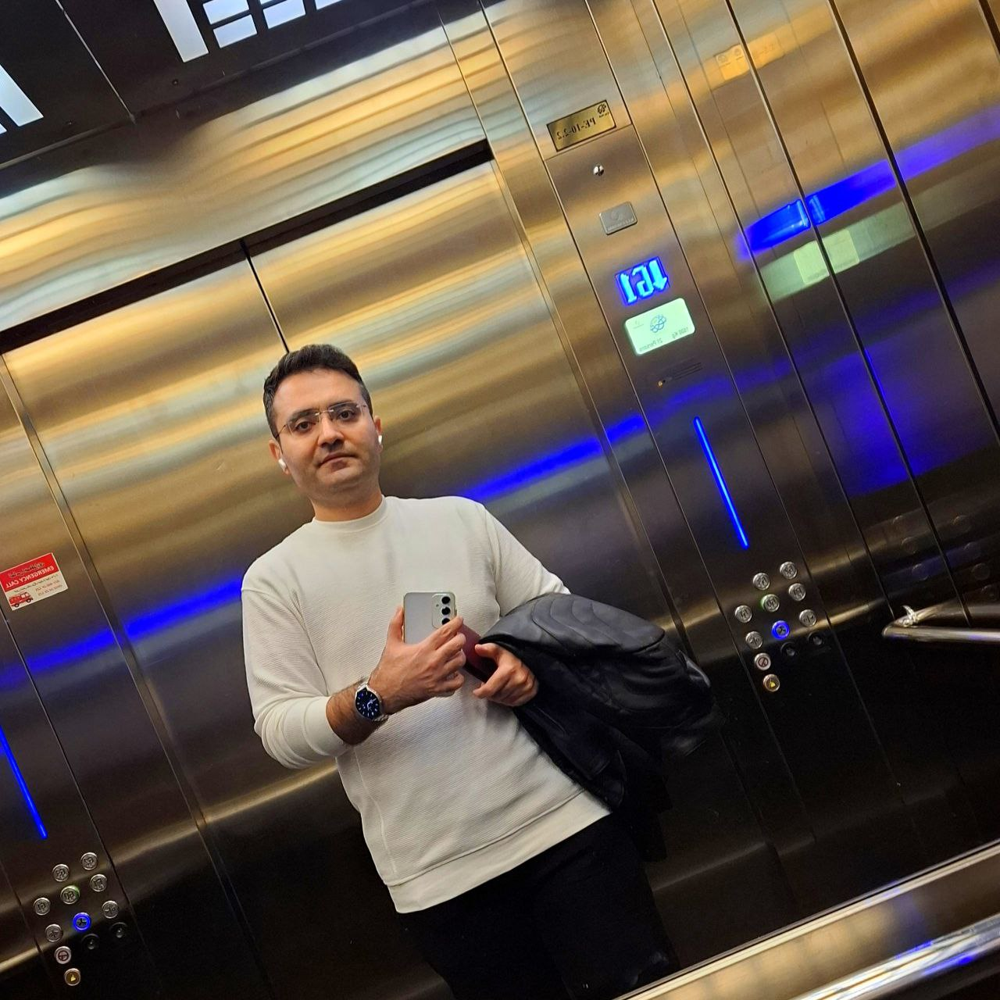

# GTA: San Andreas — Grove Street Crew Scene

**From a real portrait to a 2004 PS2-era Los Santos gameplay screenshot.**

*A reusable image-generation prompt for identity-preserving character transformations, retro game aesthetics, and detailed HUD reconstruction.*

  

---

## Before & After — Reference to Grove Street

<table>
  <tr>
    <th width="50%">📷 Original Reference</th>
    <th width="50%">🎮 Final GTA: San Andreas Result</th>
  </tr>
  <tr>
    <td align="center" valign="top"></td>
    <td align="center" valign="top"></td>
  </tr>
  <tr>
    <td align="center">Image A · Identity and appearance reference</td>
    <td align="center">Generated output · Grove Street Night Crew</td>
  </tr>
</table>

> **The concept:** Preserve the person’s recognizable identity while placing them beside CJ, Sweet, and Cesar in a low-poly Grove Street night scene, complete with a green lowrider and the classic GTA: San Andreas HUD.

### Project files

| File | Purpose |
| --- | --- |
| [`referenceImage.jpeg`](./referenceImage.jpeg) | Original photograph used as the strict identity reference (Image A). |
| [`Grove Street Night Crew.png`](./Grove%20Street%20Night%20Crew.png) | Final generated scene. |
| [`README.md`](./README.md) | Project overview, visual comparison, and complete prompt. |

## How to use this prompt

1. Upload **`referenceImage.jpeg`** (or another portrait) to an image-generation model that supports image references.
2. Copy the **Complete Image-Generation Prompt** below and submit it with the image.
3. Keep the identity-preservation instructions intact; customize clothing, scene, HUD values, or characters as needed.
4. Review the output for facial likeness, unwanted accessories, character placement, and exact HUD digits. If necessary, refine with focused edit requests.

> **Note:** This is an AI-generated artistic recreation inspired by the original game's appearance, not an actual captured gameplay screenshot. Image-generation models may make mistakes with precise text, numbers, or star counts; inspect the HUD before publishing.

---

# Complete Image-Generation Prompt

# GTA: San Andreas — Grove Street Crew Scene

## 1. Identity Preservation

Use **Image A as the strict identity reference** for the main person. Preserve their recognizable facial features, facial proportions, natural appearance, hairstyle, hair color, age, skin tone, and eyeglasses. Convert them into an authentic **Grand Theft Auto: San Andreas (2004) PS2-era character**, retaining a recognizable likeness within the original game's low-poly models and textures. Do not beautify, exaggerate, or replace their identity.

## 2. Main Character — Clothing and Appearance

The person stands confidently with **arms crossed**, in a relaxed crew-photo pose.

- Plain **white short-sleeved T-shirt**, without logos or graphics.
- Dark charcoal or black, slightly baggy trousers.
- White casual sneakers.
- Original short dark hairstyle and eyeglasses.
- Natural, slightly serious, confident expression.
- Minimal, natural-looking arm hair.
- **No watch, bracelet, wrist accessories, necklace, chain, jewelry, or earbuds.**
- Natural proportions consistent with GTA: San Andreas character models.

## 3. Characters and Composition

Create a late-night **Grove Street crew scene in Los Santos**, with four people standing side by side:

1. **CJ (Carl Johnson):** White tank top, blue jeans, black sneakers, relaxed Grove Street hand gesture.
2. **Reference person:** White T-shirt, dark trousers, white sneakers, arms crossed.
3. **Sweet Johnson:** Dark green oversized shirt, green Los Santos cap, dark trousers, confident hand gesture.
4. **Cesar Vialpando:** White tank top, gray trousers, visible tattoos, characteristic hand gesture.

Position the reference person between CJ and Sweet. Keep all four clearly visible with natural spacing and consistent scale. Make the composition feel like a casual crew photo captured directly in gameplay, not promotional artwork.

## 4. Vehicle and Environment

Place a **classic dark metallic green lowrider** directly behind the crew, featuring chrome bumpers, chrome trim, wire-spoke wheels, and authentic early-1990s Los Santos lowrider proportions.

Surround it with the recognizable Grove Street residential neighborhood: single-story houses, palm trees, wooden and chain-link fences, overhead electrical wires, warm orange streetlights, distant Grove Street members wearing green, and the downtown Los Santos skyscrapers. Set the scene in a **late-night orange-purple haze**, with softly illuminated windows and vehicle headlights.

## 5. Authentic 2004 PS2 Visual Style

Reproduce the original **Grand Theft Auto: San Andreas (2004)** visual language:

- Low-poly 3D character models and angular facial geometry.
- Early-2000s, low-resolution game textures.
- Flat, simple materials and simplified clothing folds.
- Soft ambient game lighting and basic shadows.
- Original-style character and vehicle proportions.
- Classic PS2 environmental textures and San Andreas color grading.
- An authentic in-game screenshot appearance.

**Avoid:** photorealism, GTA V or GTA VI graphics, Unreal Engine 5 aesthetics, modern cinematic models, hyper-detailed skin or fabric, ray tracing, physically based rendering, anime, and cartoon illustration.

## 6. GTA HUD — Exact Values

Include the original GTA: San Andreas gameplay HUD.

**Upper right:**

- Time: **23:23**
- Money: **$01136936** (exact digits, including the leading zero)
- Wanted level: **exactly three active gold stars**; other stars inactive.
- Original white fist icon.
- Classic white armor bar and red health bar.
- Original black outlines, positioning, and HUD typography.

**Lower left:**

- Original circular GTA: San Andreas radar with Grove Street neighborhood map.
- White player-position marker and north direction indicator.
- Green safehouse icon.
- Original game-style map colors and borders.

All HUD numbers must be rendered **exactly**.

## 7. Camera and Framing

- **Vertical 4:5 aspect ratio.**
- Medium-wide, full-body group composition.
- Camera near chest height, with authentic gameplay perspective.
- All four characters visible from head to shoes, without cropping.
- Green lowrider visible behind them.
- Downtown skyline visible above the houses.
- HUD fully readable and unobstructed.

## 8. Text and Restrictions

Do **not** display mission instructions, subtitles, or the phrase **“Meet up with Sweet.”** Do not add captions, signatures, watermarks, promotional text, or modern overlays. Only the original-style gameplay HUD may contain text.

## 9. Final Quality Requirements

The output must convincingly resemble a genuine **2004 PS2-era GTA: San Andreas gameplay screenshot**, naturally integrating the reference person into the Grove Street crew.

**Priorities, in order:**

1. Preserve the reference person's identity.
2. Match the original GTA: San Andreas visual style.
3. Match the specified clothing and **remove all jewelry and accessories**.
4. Reproduce **23:23**, **$01136936**, and **three active wanted stars** accurately.
5. Reproduce the Grove Street environment and green lowrider.
6. Maintain a natural, balanced four-person composition.

**Deliverable:** One vertical **4:5** image, without watermark, mission text, watch, bracelet, necklace, or other jewelry.

---

## Repository and attribution

This project is part of [funPromptsImaginary](https://github.com/parviznarimani/funPromptsImaginary), a collection of creative image-generation experiments and reusable prompts.

**Game inspiration:** *Grand Theft Auto: San Andreas* (2004), developed by Rockstar North and published by Rockstar Games. Character names and game-related visual elements belong to their respective rights holders. This is an unofficial fan-made AI artwork and is not affiliated with or endorsed by Rockstar Games.

**Grove Street, reimagined — 23:23 · $01136936 · ★★★**

